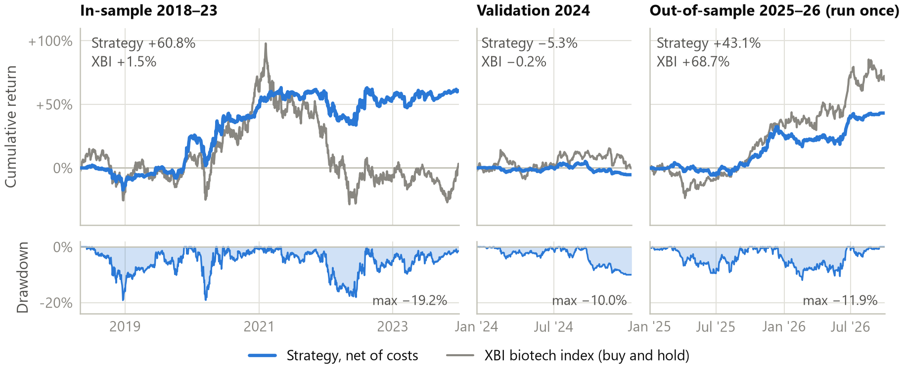
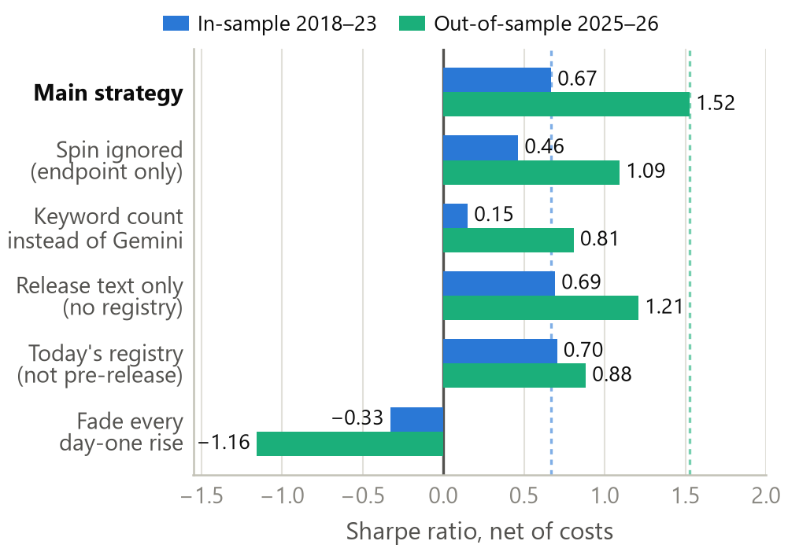
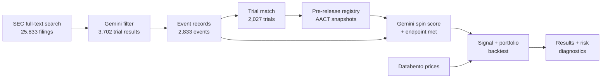

# Spin vs. Substance: Trading Biotech Trial Readouts

**Gator Quant Hacks 2026 · Systematic Trading track**

Small and mid-cap biotech companies announce clinical-trial results in press releases. Some releases say exactly what the trial found; others *spin* it, leading with secondary endpoints, subgroups or "positive trends" when the registered primary endpoint failed. We measure that spin at scale with Google Gemini, comparing each release against the trial's **primary endpoint as it was registered on ClinicalTrials.gov before the release** (when the trial can be matched; otherwise the release is scored on its own), and trade the stock with a fixed, pre-registered rule.

> **Hypothesis:** investors price the headline, not the substance. Spun releases that the market believes drift back down; clean results keep drifting in their direction.

<details>
<summary><b>Full hypothesis, as committed before any results (and how it held up)</b></summary>

From [`HYPOTHESIS.md`](HYPOTHESIS.md), unchanged since it was committed:

> We expect liquid US small- and mid-cap biotech stocks to move toward what the trial data actually supports over the 5 to 20 trading days after a trial-results press release, because investors price the headline, not the substance: a spun release pushes the price too high and it falls back, while a clean result is underpriced at first and keeps drifting in its direction. The edge persists because reading trial data takes expertise most retail traders lack, these stocks get little analyst coverage, and betting against an overpriced small biotech is costly for arbitrageurs.

| Committed claim | What we found |
|---|---|
| Spun releases that rise on day one fall back | **Right direction, not significant:** out-of-sample these stocks fell 12.0% vs XBI over 60 days (n = 18; 95% interval −23.5% to +0.5%); in-sample they fell 2.4% (not significant) |
| Clean results keep drifting in their direction | **Mixed:** clean-success longs earned almost all of the profit, but their 60-day drift is not statistically significant; clean-failure shorts did not work |
| Higher spin → larger decline | **Not supported:** no steady pattern across spin scores 0–4 |
| The move happens within 5–20 trading days | **Not supported:** one-day holds lost money in every period and the 60-day hold, the longest tested, did best |
| Fails if the out-of-sample result is near zero after costs | **Did not fail:** out-of-sample Sharpe 1.52 net of costs, though the 2024 validation check failed |

</details>

📄 **Research note:** [`QUANT_NOTE.pdf`](QUANT_NOTE.pdf) · 📋 **Pre-registered rules:** [`HYPOTHESIS.md`](HYPOTHESIS.md) · 🕒 **Change log:** [`VARIANTS.md`](VARIANTS.md)

---

## Results at a glance

All figures are **net of costs** (20 bps per side, 10%/yr short borrow), starting capital $1M, 60-trading-day holds.

| | In-sample<br>2018-05 → 2023-12 | Validation<br>2024 | **Out-of-sample**<br>**2025-01 → 2026-10** |
|---|---:|---:|---:|
| Annual return | +8.8% | −5.3% | **+22.9%** |
| Volatility | 14.0% | 8.4% | 14.2% |
| Sharpe ratio | 0.67 | −0.61 | **1.52** |
| Max drawdown | −19.2% | −10.0% | **−11.9%** |
| Turnover per year | 3.7× | 3.9× | 4.5× |
| Trades | 325 | 51 | **107** |
| Win rate | 48% | 37% | **55%** |
| Beta to XBI (biotech index) | 0.27 | 0.15 | **0.30** |
| Alpha after XBI + S&P 500 (per year) | +7.2% (t = 1.6) | −8.1% (t = −1.1) | **+12.5% (t = 1.5)** |

The out-of-sample period was **run exactly once**, with every rule frozen beforehand ([`results/OOS_LOCK.json`](results/OOS_LOCK.json)). Its Sharpe ratio's 95% interval is 0.03 to 3.01.

<p align="center"></p>

**How to read this honestly.** The out-of-sample result is strong, but it came during a biotech rally (XBI +69% over the same window), and the alpha after XBI and the S&P 500 is not statistically significant (t = 1.5). Clean-success longs earned almost all of the profit, the top five trades made 79% of P&L in-sample and 61% out-of-sample, every 60-day event-study interval includes zero, and the 2024 validation check **failed**. We kept the frozen rules regardless. Details in the [research note](QUANT_NOTE.pdf).

### What each ingredient adds (Sharpe ratio)

Each variant changes **one** thing relative to the main strategy. Differences are not tested for significance, and in 2024 every variant had a negative Sharpe.

<p align="center"></p>

| Variant | In-sample | Out-of-sample | Compared with the main strategy |
|---|---:|---:|---|
| **Main strategy** | **0.67** | **1.52** | |
| Spin ignored (trade the trial result only) | 0.46 | 1.09 | Lower in both periods |
| Keyword spin instead of Gemini | 0.15 | 0.81 | Lower in all three periods |
| Today's registry instead of the pre-release version | 0.70 | 0.88 | Lower out-of-sample, about equal in-sample |
| Release text only (no registry) | 0.69 | 1.21 | Lower out-of-sample, about equal in-sample |
| Fade the day-one move only | −0.33 | −1.16 | Loses money: not a simple reversal effect |
| Long-only | 0.49 | 1.18 | Lower without the shorts |
| Doubled costs | 0.53 | 1.38 | Still positive |
| Delisted longs lose 30% / 100% | 0.61 / 0.46 | 1.37 / 0.98 | Still positive |

---

## The strategy

| Step | Rule |
|---|---|
| **Universe** | US-listed pharma/biotech (SEC SIC 2834, 2836, 8731), market cap $300M–$10B, 20-day Nasdaq dollar volume ≥ $1.2M, measured before the event |
| **Event** | A press release (8-K) announcing new human clinical-trial results |
| **Measurement** | Gemini scores **spin 0–4** and **primary endpoint met (yes / no / unclear)** by comparing the redacted release with the trial's registry entry *as it stood before the release* (AACT monthly snapshots), or the release alone when no trial can be matched |
| **Signal** | **Spun (2–4) and the stock beat XBI on day one → short.** **Clean (0–1) and endpoint met → long. Clean and endpoint missed → short.** Otherwise no trade |
| **Execution** | Signal fixed at the first reaction-day close; enter at the **next** session's close; exit 60 trading days later |
| **Sizing** | min(5% of equity, 1% of 20-day Nasdaq dollar volume); max 20 positions, one per stock, ≤100% gross, no leverage |
| **Costs** | 20 bps per side; 10%/yr borrow on shorts; stress test at 2× |

The holding period (60 days) was chosen by a fixed, pre-registered rule on 2018–2023 data, checked on 2024 (the check failed), and locked before the out-of-sample run.

### How Gemini is used

Gemini (`gemini-3.1-flash-lite`) is the measuring instrument, never the trader: a fixed rule makes every trading decision. Every call uses temperature 0, a fixed JSON answer format and no web search, and all 28,336 answers are saved in `labels/`, so the pipeline re-runs without new API calls.

| Step | Question for Gemini | Answers |
|---|---|---:|
| Filter | Does this release announce new human trial results? | 13,739 |
| Extract | Ticker, drug, phase, dateline; a repeat of earlier results? | 3,702 |
| Match | Which candidate ClinicalTrials.gov trial is reported? | 1,950 |
| Check | Same drug and disease as the matched trial? | 2,027 |
| Score | Spin 0–4 and primary endpoint met (three versions per readout) | 6,918 |

Checks: Gemini's endpoint call agreed with 6 of 6 held-out hand labels; on a 30-event audit (labeled blind by an AI reader, then checked by a team member), the trial match was right in 28 and Gemini put 26 in the same clean/spun group. A ten-phrase keyword count in place of Gemini's score lowers Sharpe in every period.

## Safeguards

- **No lookahead.** Registry text comes from snapshots dated *before* each release; SEC filing times are converted to New York time; entry is one session after the signal; data-quality filters only use information available when the signal forms.
- **Pre-registered.** The hypothesis and rules were committed before any returns were computed; every later change is timestamped in [`VARIANTS.md`](VARIANTS.md) with whether results had been seen.
- **One-shot holdout.** The out-of-sample test writes a lock with a SHA-256 fingerprint of all inputs, code and package versions *before* computing anything; changed re-runs are refused.
- **Independently reviewed.** Three mock-judge code reviews; every issue was fixed (or measured and disclosed) before the first real backtest.
- **Tested and reproducible.** 35 regression tests on invented data; `run_all.py` reproduces every committed result table and the out-of-sample fingerprint exactly, and `run_all.py --check` verifies the headline numbers with no API keys.

---

## Reproduce the results

**Quick check, no API keys (a few seconds):** runs the 35 regression tests and recomputes every headline number in the note from the committed results.

```bash
git clone https://github.com/JBailey0703/spin-vs-substance.git
cd spin-vs-substance
python -m venv .venv
.venv\Scripts\activate            # macOS/Linux: source .venv/bin/activate
pip install -r requirements.txt   # exact environment: requirements-lock.txt (Python 3.11)
python run_all.py --check
```

**Full reproduction (needs keys and about $8 of Databento data):**

```bash
copy .env.example .env            # macOS/Linux: cp .env.example .env  — then fill in your keys
python run_all.py --yes
python src/make_figures.py        # optional: regenerate the note's figures into figures/
```

`run_all.py` downloads prices, re-runs the in-sample backtest and an identical re-run of the frozen out-of-sample test into `reproduced/`, re-runs the risk diagnostics, the parameter sensitivity grid and the regression tests, and compares every output with the committed results. It ends with:

```
REPRODUCED: every committed result matches.
```

| Key (`.env`) | Needed for | Cost |
|---|---|---|
| `SEC_USER_AGENT` | All SEC steps | Free |
| `DATABENTO_API_KEY` | Prices (`--yes` allows the download) | ≈ $8 on a fresh clone |
| `GEMINI_API_KEY` | Only to re-run the AI steps (`--full`); all answers are saved in `labels/` | — |
| `MASSIVE_API_KEY` | Only the event search and its recall check (`--full`) | — |
| `WEBULL_*` | Only the optional Databento-vs-Webull price cross-check | — |

`python run_all.py --full --yes` first rebuilds the whole event pipeline from SEC (reusing the saved Gemini answers; it also needs the Gemini and Massive keys). Run the tests alone with `python tests/test_backtest.py`.

---

## Pipeline



| # | Script | What it does | Output |
|---|---|---|---|
| 1 | `src/find_events.py` | SEC full-text search of biotech 8-Ks for trial-result language | `data/events/sec_candidates.csv` |
| 2 | `src/check_coverage.py` | Recall check against Massive's independent tags (88%) | printed |
| 3 | `src/download_docs.py` | Downloads each press release's text | `data/raw/docs/` (not committed) |
| 4 | `src/filter_events.py` | Gemini: does this release announce new human trial results? | `data/events/trial_events.csv` |
| 5 | `src/extract_events.py` | Gemini: ticker, drug, phase, trial ID | `data/events/extracted.csv` |
| 6 | `src/build_events.py` | Timing (UTC→New York), reaction day, ticker, shares, repeats | `data/events/event_records.csv` |
| 7 | `src/match_trials.py` | Matches each event to its ClinicalTrials.gov trial | `data/events/matched_records.csv` |
| 8 | `src/aact_extract.py` | Pre-release endpoints from AACT monthly snapshots (2018–2026) | `data/events/registry_snapshots.csv` |
| 9 | `src/verify_matches.py` | Gemini: is the matched trial the one reported? (wrong → text-only score) | `data/events/match_checks.csv` |
| 10 | `src/score_spin.py` | Gemini spin score + endpoint met (pre-release registry, text-only, today's registry) | `data/events/spin_scores.csv` |
| 11 | `src/keyword_spin.py` | Keyword-rule spin baseline | `data/events/keyword_spin.csv` |
| 12 | `src/download_event_prices.py` | Databento hour bars → regular-hours daily bars | `data/prices/` (not committed) |
| 13 | `src/check_splits.py` | Classifies large one-day price jumps (split vs real move) | `data/events/price_jumps.csv` |
| 14 | `src/backtest.py` | Event study, portfolio simulation, horizon choice, out-of-sample (once) | `results/` |
| 15 | `src/risk_diagnostics.py` | Tail, exposure, factor, correlation and regime risk | `analysis/` |
| 16 | `src/sensitivity.py` | Parameter sensitivity: nine one-change neighbors, all periods | `analysis/sensitivity.csv` |
| 17 | `src/make_figures.py` | The note's figures, from the frozen results | `figures/` |

Helpers: `check_apis.py` (key check), `check_filter.py`, `check_hand_labels.py`, `download_prices.py` (price cross-check).

## Repository map

```
├── README.md                this page
├── QUANT_NOTE.pdf           research note (5 pages + references + appendix)
├── HYPOTHESIS.md            hypothesis and rules, committed before any results
├── VARIANTS.md              timestamped log of every rule change
├── run_all.py               one-command reproduction
├── requirements.txt         pinned dependencies (+ requirements-lock.txt)
├── .env.example             API keys needed, by step
├── src/                     pipeline scripts (table above)
├── tests/                   35 regression tests on invented data
├── data/events/             every pipeline stage's output (derived, public data)
├── labels/                  saved Gemini answers, hand labels, blind audit
├── results/                 frozen backtest outputs (never edited)
├── analysis/                risk diagnostics and parameter sensitivity
├── figures/                 the note's figures (src/make_figures.py)
└── gqh-webull-backtrader-starter/   hackathon starter code (used for the price cross-check)
```

<details>
<summary><b>Data dictionary</b></summary>

| File | Contents |
|---|---|
| `data/events/sec_candidates.csv` | Candidate SEC documents (rows are documents, not events) |
| `data/events/trial_events.csv` | Filings Gemini classified as new trial results |
| `data/events/extracted.csv` | Extracted ticker, drug, phase, trial IDs, release date |
| `data/events/event_records.csv` | One record per readout: timing, reaction day, ticker, shares outstanding |
| `data/events/excluded_events.csv` | Events dropped for contradictory or unverifiable dates, with reasons |
| `data/events/matched_records.csv` | Trial matches and today's registry fields (diagnostic only) |
| `data/events/registry_snapshots.csv` | Endpoints and design from 35 AACT snapshots (only our trials) |
| `data/events/match_checks.csv` | Gemini's same-trial check for every match |
| `data/events/spin_scores.csv` | Spin and endpoint scores; `spin_used` / `met_used` drive the strategy |
| `data/events/keyword_spin.csv` | Keyword-rule spin scores |
| `data/events/price_jumps.csv` | Large one-day price jumps and their classification |
| `data/events/manual_exclusions.csv` | The only hand-removed event, with its reason |
| `labels/hand_labels.csv` | 15 hand-labeled releases (rubric, few-shot examples, test set) |
| `labels/spin_test_results.csv` | Gemini vs hand labels on the held-out test set |
| `labels/blind_audit.csv` | 30-event audit: labeled blind by an AI reader, then checked by a team member (human_* columns) |
| `labels/*.json` | Saved Gemini answers, so the pipeline re-runs without API calls |
| `results/` | Event studies, horizon sweep, variants, equity curves, trades, capacity, attrition, OOS lock |
| `analysis/risk_diagnostics.csv` | VaR, expected shortfall, exposure, betas, position correlation, regime returns |
| `analysis/sensitivity.csv` | Nine one-change parameter neighbors, Sharpe and returns for every period |

</details>

## Data sources

| Source | Used for |
|---|---|
| [SEC EDGAR](https://www.sec.gov/edgar) | Event discovery, press-release text, filing timestamps, shares outstanding |
| [ClinicalTrials.gov](https://clinicaltrials.gov) API v2 | Trial matching |
| [AACT](https://aact.ctti-clinicaltrials.org) (CTTI) | Monthly archives of the full registry → endpoints as they stood before each release |
| [Databento](https://databento.com) XNAS.ITCH | Prices for every stock, including delisted companies (no survivorship bias) |
| [Google Gemini](https://ai.google.dev) (`gemini-3.1-flash-lite`, temperature 0) | Filtering, extraction, match checks, spin scoring |
| Massive | Independent check of event-search recall |
| Webull OpenAPI | Cross-check of Databento prices |

Licensed price data and raw API responses are **not** committed; the scripts re-download them.

## Limitations

The out-of-sample window is a single 21-month biotech rally; profits are concentrated in a few large winners; the 2024 confirmation failed; every 60-day event-study interval includes zero; the spin score shows no clean dose-response across 0–4; trial matching, split ratios and delisting exits rely on documented approximations; short borrow availability is assumed; and Gemini may know in-sample events (its knowledge cutoff is January 2025, so only out-of-sample readouts from that month could be in its training). Each is quantified in the [research note](QUANT_NOTE.pdf).

## Team

- **Jackson Bailey** ([@JBailey0703](https://github.com/JBailey0703))
- **Jade L'Heureux** ([@jlheureux-prog](https://github.com/jlheureux-prog))

Built for Gator Quant Hacks 2026. The `gqh-webull-backtrader-starter/` folder is the hackathon's starter code (Webull OpenAPI + backtrader), kept with attribution for the price cross-check; the research pipeline in `src/` is our own.
